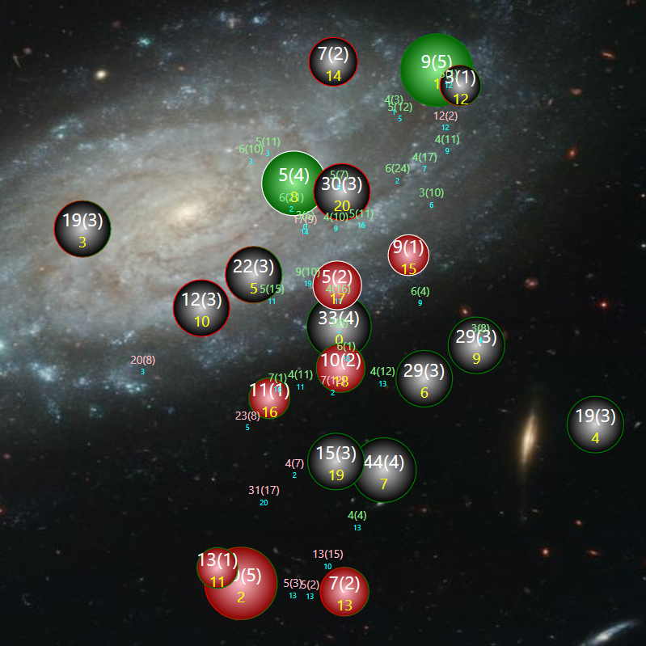

# SPACE WAR 2000

 

v0.2 4/25/2019

(Image: planets colored by owner, planet ids in yellow, population(growth rate) label, fleets colored by owner, population(turns left) label, cyan planet destination.)

Space War 2000 is a simultaneous turn-based a 2-Player space battle for AI bots. The battlefield is a 2D collection of **planets**, each with a **population** of ships and a **growth rate**. Each planet is owned by **Player 1** or **Player 2** or **Unowned**. Players use populations of planets they control to launch **fleets** to attack other planets. The goal is to eliminate the opposing player or to have the highest population when the turn limit for the game is reached, which is currently 200 turns.

## Bot interface
A bot is a windows executable that reads standard input and writes to standard output. The commands are

| Command                | Meaning                                                         |
|------------------------|-----------------------------------------------------------------|
| START enemyName seed E | enemyName is a string, seed is an integer for seeding your rand |
| STATE stateData      E | stateData  is the state of the world, detailed below            |
| RESULT result        E | result is Win,Loss,Tie at the end of a game                     |
| QUIT                 E | Bot program should exit                                         |

The bot, after receiving the state, must return a list of fleets to launch. This format is below. For each command, the final token `E` ends the command. You may have to read input till you parse it. See the example code.

### State data
The state is sent to the bot as one long string. Windows limits are (I think) 8192 chars, so all commands must be shorter than this (which is easy to do).

The state is a whitespace separated list of tokens, with the following formats:

| Item   | tokens                                   | Notes                                               |
|--------|------------------------------------------|-----------------------------------------------------|
| Planet | P x y owner ships growth                 | owner is 0 for unowned, 1 for your bot, 2 for enemy | 
| Fleet  | F owner ships source dest turnsRemaining | turnsRemaining is how long till fleet lands         | 

All values other than x and y are integers. **x** and **y** are doubles.
**owner** is the id of the item owner: 0 = unowned, 1 = Player 1 (your bot), 2 = Player 2 = the enemy.
**source** and **dest** are planet ids, 0+, ordered by the order in the state. These do not change during a game. **turnsRemaining** is how long till the fleet lands. This is computed as the distance between planets as a double, then rounded up, when the fleet is launched. It decrements one per turn. Thus a fleet takes as many turns to go between two planets as their distance, rounded up. The game is played in normal 2D Euclidean space, coords can be negative, and the board is roughly bounded to make the distances not too large to send fleets across in reasonable times.

Sending string across the command line seems to replace \n with nothing, so be sure to at least add a space between tokens.

### Bot response

After receiving state data, the bot must return a single string with the list of fleets it wishes to launch. This has the format **`MOVE fleets E`** where fleets is a list of fleet launch commands, each of form **L src dst ship**

Each turn the player can send fleets from any planet the player owns to any other planet as long enough ships are on the source planet. Multiple fleets can be sent from the same planet, if the total does not exceed the number on the planet. Multiple fleets can be sent to a destination planet.

Invalid orders lose immediately.

Bots have 5 seconds to reply, otherwise they forfeit.

## Gameplay
Each turn the game engine does the following four steps:
1. **Send state**. Each bot is sent the state via the interface as detailed above.

2. **Receive orders**. The reply from each bot is gathered. 

3. **Update state**. This is is done in three steps: **departure** (fleets leave planets), **advancement** (fleets move closer, and planet growth rate adds to planet population), and **arrival** (battle resolution).  **Arrival**: Destination planets are handled one at a time. Any fleets reaching 0 turns left land, and all fleets and planet population merge or do battle. The owner with the most has the second most subtracted and becomes the owner of the planet. The third most is simply killed. If no one is left, the planet stays with the owner before the arrival.

4. **Endgame**
The game is over when one of:
    1.  Turn limit is reached. The winner is the one with the most ships (total on planets and in fleets).
    2.  One player has no planets or fleets, and the other does. The other player wins.
    3.  A bot sends an invalid request causes an immediate loss.
    4.  A bot runs over the time allowed.

END OF FILE
